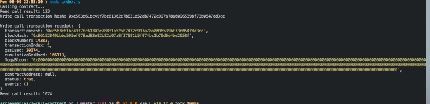

# Task 03

### Contract Call



### Transaction Hash

0xe563e61bc49f7bc61302e7b831a52ab7472e997a78a0096539bf73b0547dd3ce


### Contract address

0x6F61d89aF16c1eC49Fc5c4e6213915ddf8A3cCb0


### Contract ABI

```
  [
    {
      "inputs": [],
      "stateMutability": "payable",
      "type": "constructor"
    },
    {
      "inputs": [
        {
          "internalType": "uint256",
          "name": "x",
          "type": "uint256"
        }
      ],
      "name": "set",
      "outputs": [],
      "stateMutability": "payable",
      "type": "function"
    },
    {
      "inputs": [],
      "name": "get",
      "outputs": [
        {
          "internalType": "uint256",
          "name": "",
          "type": "uint256"
        }
      ],
      "stateMutability": "view",
      "type": "function"
    }
  ]
```
