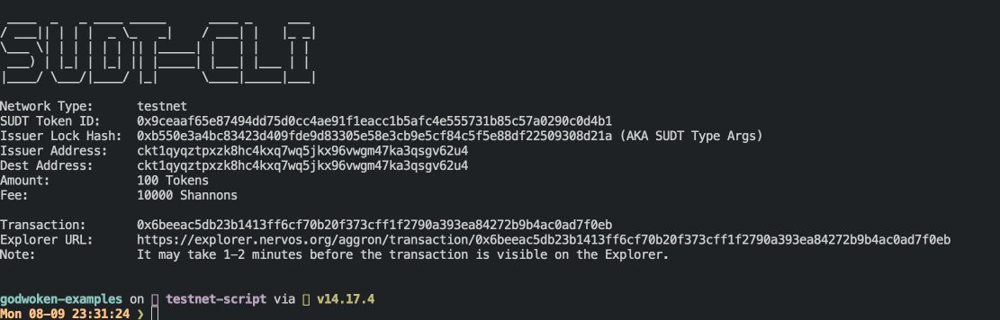
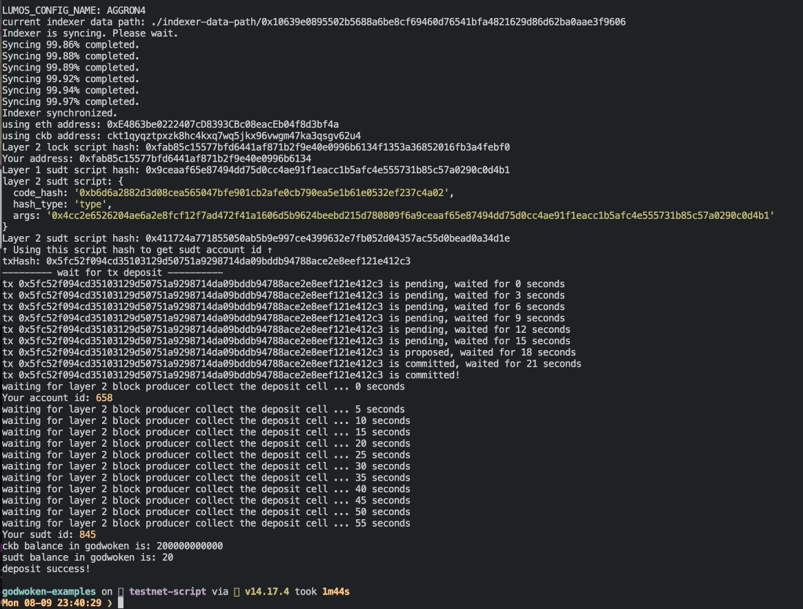

# Task 04

### Layer 1 address
[https://explorer.nervos.org/aggron/address/ckt1qyqztpxzk8hc4kxq7wq5jkx96vwgm47ka3qsgv62u4](https://explorer.nervos.org/aggron/address/ckt1qyqztpxzk8hc4kxq7wq5jkx96vwgm47ka3qsgv62u4)

### issue token

### issue token transaction

[https://explorer.nervos.org/aggron/transaction/0x6beeac5db23b1413ff6cf70b20f373cff1f2790a393ea84272b9b4ac0ad7f0eb](https://explorer.nervos.org/aggron/transaction/0x6beeac5db23b1413ff6cf70b20f373cff1f2790a393ea84272b9b4ac0ad7f0eb)

### A screenshot of the console output immediately after you have successfully submitted a deposit to Layer 2 using the account-cli tool.

### The SUDT ID from the console output after executing the deposit script (in text format).

845

