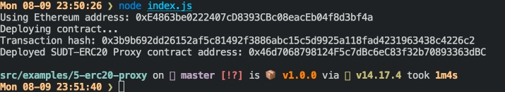
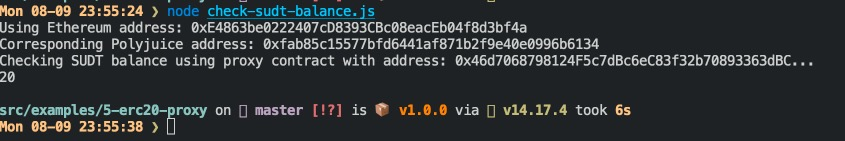
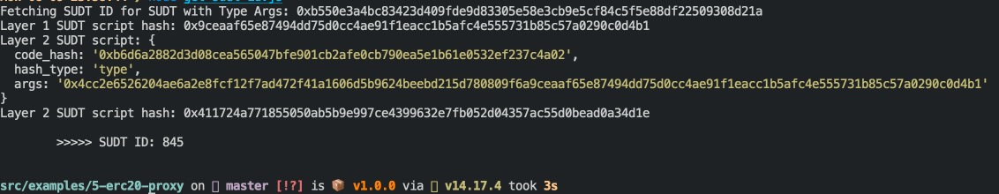

# Task 05

### A screenshot of the console output immediately after deploying smart contract.

### The address of the ERC20 Proxy Contract you deployed (in text format).

0x46d7068798124F5c7dBc6eC83f32b70893363dBC

### A screenshot of the console output immediately after checking your SUDT balance.

### The Ethereum address that was checked (in text format).

0xE4863be0222407cD8393CBc08eacEb04f8d3bf4a

### Get Layer 2 SUDT ID from Layer 1 SUDT Issuer Lock Hash (AKA SUDT Type Args)

