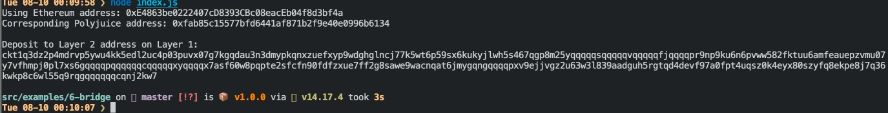

# Task 06

### A screenshot of the console output immediately after you have successfully generated your Deposit Receiver Address.

### Your Deposit Receiver Address (in text format).

ckt1q3dz2p4mdrvp5ywu4kk5edl2uc4p03puvx07g7kgqdau3n3dmypkqnxzuefxyp9wdghglncj77k5wt6p59sx6kukyjlwh5s467qgp8m25yqqqqqsqqqqqvqqqqqfjqqqqpr9np9ku6n6pvww582fktuu6amfeauepzvmu07y7vfhmpj0pl7xs6gqqqqpqqqqqqcqqqqqxyqqqqx7asf60w8pqpte2sfcfn90fdfzxue7ff2g8sawe9wacnqat6jmygqngqqqqpxv9ejjvgz2u63w3l839aadguh5rgtqd4devf97a0fpt4uqsz0k4eyx80szyfq8ekpe8j7q36kwkp8c6wl55q9rqgqqqqqqcqnj2kw7

### The Ethereum address used to generate the Deposit Receiver Address (in text format).

0xE4863be0222407cD8393CBc08eacEb04f8d3bf4a

### A link to the Etherscan explorer for the successful Force Bridge transaction. This can be found on Force Bridge under History→Succeed.

[https://rinkeby.etherscan.io/tx/0x58ba0afb95ef4c118bea6d1e36da794c7d7d292e5f08d5c2abb1fa03a429fcbb](https://rinkeby.etherscan.io/tx/0x58ba0afb95ef4c118bea6d1e36da794c7d7d292e5f08d5c2abb1fa03a429fcbb)

### A link to the Nervos explorer for the successful Force bridge transaction. This can be found on Force Bridge under History→Succeed.
[https://explorer.nervos.org/aggron/transaction/0x9f879b815a2c24f171db4369adbd0639ece662e78f5b53f094d65a103d24a8c0](https://explorer.nervos.org/aggron/transaction/0x9f879b815a2c24f171db4369adbd0639ece662e78f5b53f094d65a103d24a8c0)

