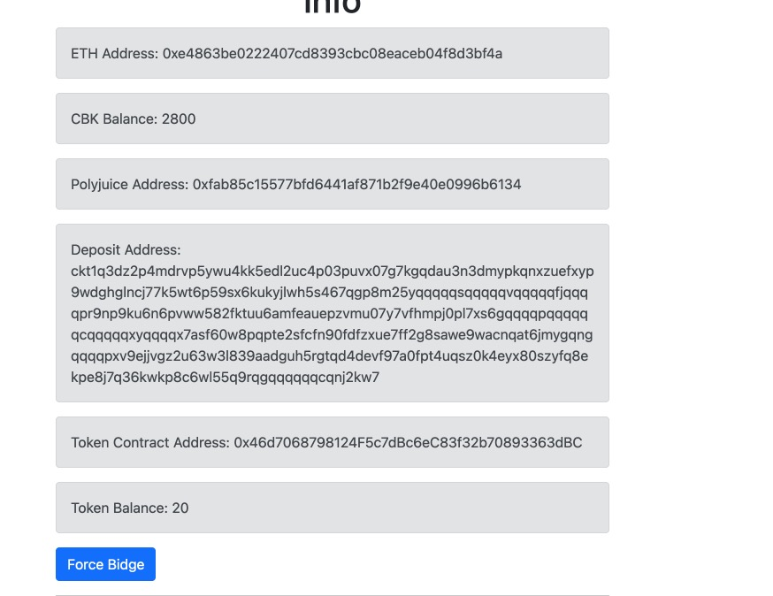

# Task 08

I use `ethers.js` in last task, but seems `nervos-godwoken-integration` dose not support `ethers.js`,
so I only keep some codes from last task, and use `web3.js` in this one.

### A screenshot or video of your EVM application on Layer 2 with Force Bridge support.

### The address of the SUDT-ERC20 Proxy Contract that you deployed (in text format).

0x46d7068798124F5c7dBc6eC83f32b70893363dBC

### A link to the GitHub repository with your EVM application that integrates Force Bridge support.

[https://github.com/niedhui/nervos-hackaton/tree/main/08/force-bridge](https://github.com/niedhui/nervos-hackaton/tree/main/08/force-bridge)
