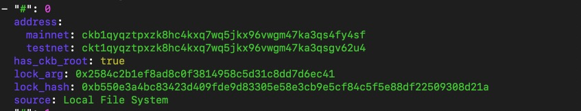
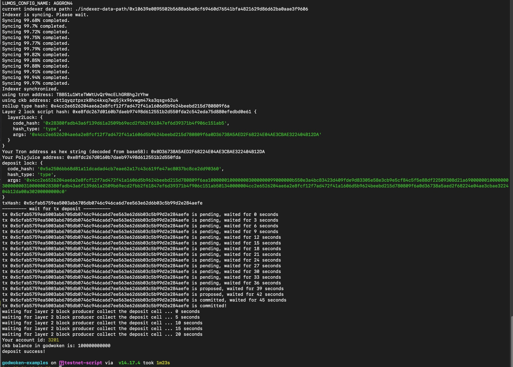
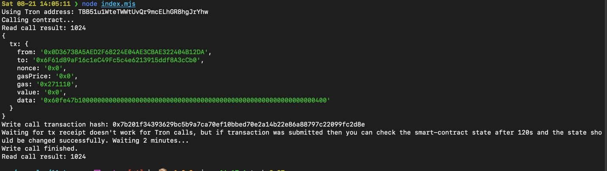

# Task 11

## A screenshot of the accounts you created (account list) in ckb-cli.



## A link to the Layer 1 address you funded on the Testnet Explorer.

[https://explorer.nervos.org/aggron/address/ckt1qyqztpxzk8hc4kxq7wq5jkx96vwgm47ka3qsgv62u4](https://explorer.nervos.org/aggron/address/ckt1qyqztpxzk8hc4kxq7wq5jkx96vwgm47ka3qsgv62u4)


## A screenshot of the console output immediately after you have successfully submitted a CKByte deposit to your Tron account on Layer 2.



## A screenshot of the console output immediately after you have successfully issued a smart contract calls on Layer 2.



## The transaction hash of the "Contract call" from the console output (in text format).

0x7b201f34393629bc5b9a7ca70ef10bbed70e2a14b22e86a88797c22099fc2d8e


## The contract address that you called (in text format).

0x6F61d89aF16c1eC49Fc5c4e6213915ddf8A3cCb0

## The ABI for contract you made a call on (in text format).

```
  [
    {
      "inputs": [],
      "stateMutability": "payable",
      "type": "constructor"
    },
    {
      "inputs": [
        {
          "internalType": "uint256",
          "name": "x",
          "type": "uint256"
        }
      ],
      "name": "set",
      "outputs": [],
      "stateMutability": "payable",
      "type": "function"
    },
    {
      "inputs": [],
      "name": "get",
      "outputs": [
        {
          "internalType": "uint256",
          "name": "",
          "type": "uint256"
        }
      ],
      "stateMutability": "view",
      "type": "function"
    }
  ]
```

## Your Tron address (in text format).

TBB51u1WteTWWtUvQr9mcELhGR8hgJrYhw
